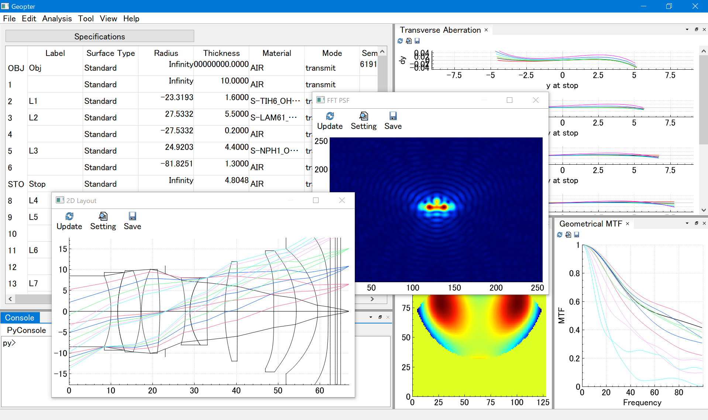

# Geopter

## Introduction
Geopter is <u>**opt**</u>ical design software based on <u>**geo**</u>metrical ray tracing.

As for optical design tools, there are several proprietary software with advanced features to be a definitive choice for professional work. However, there seem to be few private users due to their unaffordable cost for an annual license.

Open source projects may well be another option to get exposure to optical design. It is a fact that more and more optical simulation library are being developed recently. One of the disadvantage of such library is to require matured programming skills to master how to use.

Geopter aims to be somewhere in between. This software features to emphasize reasonable graphical interface, allowing users to focus on optical design process. Also, as is common with open source projects, the software is freely available and its whole internal aspects are open to the public.

The primary user of this software may be a fresh optical engineer or a student having interests in optics.  Geopter hopes to be a starting platform to gain an introductory experience in optical design.

## Getting Started
### Prebuilt Binaries
Prebuilt binaries can be downloaded in [Release page](https://github.com/heterophyllus/Geopter/releases/latest).

### Build from Source
Qt is supposed to be installed in your computer.
All of the dependencies except Qt itself have been included in this repository, so QtCreator can build project by reading CMakeLists.txt.

Another way is to create Visual Studio Solution using CMake.

### Examples
Some example lenses are stored in "example" folder in json format.  In Geopter GUI, go File->Open and select a json file.

## Dependencies

|Library|Description|
|---|---|
|[Qt](https://www.qt.io)|widget toolkit for GUI|
|[Qt Advansed Docking System](https://github.com/githubuser0xFFFF/Qt-Advanced-Docking-System)|Flexible docking layout system|
|[QCustomPlot](https://www.qcustomplot.com)|Graph plotting library |
|[nlohman/json](https://github.com/nlohmann/json)|JSON utility|
|[Eigen](https://eigen.tuxfamily.org/index.php?title=Main_Page)|template library for linear algebra|
|[ttk592/spline](https://github.com/ttk592/spline)|spline interpolation|

## License
This project is licensed under GPL license - see the [LICENSE](LICENSE.md) for details.

## Authors
- Hiiragi <heterophyllus.work@gmail.com>

## Contributing
Contributions and feedbacks are greatly appreciated.
Please read [CONTRIBUTING](CONTRIBUTING.md) for details on our code of conduct, and the process for submitting pull requests to us.

## Acknowledgement
The author would like to express respect and gratitude to the following excellent projects for their reference implementation of optical calculation.

- [mjhoptics/ray-optics](https://github.com/mjhoptics/ray-optics) : Highly matured python module for geometrical optical simulation.  Most of Geopter's optics calculation is based on this implementation.
- [Goptical](https://www.gnu.org/software/goptical/) : C++ implemenation of optical simulation with great deal of functionalities. Though this original project has not been updated since 2012.
- [dibyendumajumdar/goptical](https://github.com/dibyendumajumdar/goptical) : A modified fork of Goptical, which has been maintained with greatest effort. This project features to analyze many lens data from patent documents.

